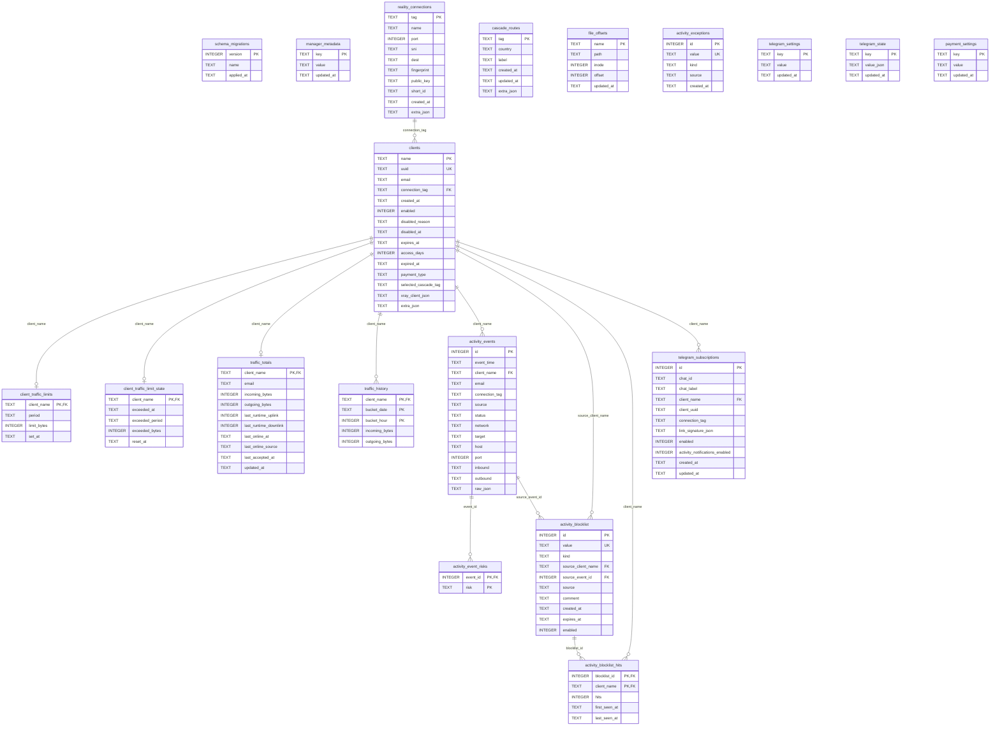

# Схема базы данных

[← README](../README.md)

SQLite-база менеджера хранится на сервере здесь:

```text
/usr/local/etc/xray/manager.db
```

Текущая версия схемы:

```text
schema version = 4
```

Актуальное определение схемы находится в `xray_vps_manager/db/schema.py`.

## Общая схема



## Логические блоки

### Служебные таблицы

| Таблица | Назначение |
|---|---|
| `schema_migrations` | История применённых миграций схемы. |
| `manager_metadata` | Служебные флаги и метаданные менеджера, например отметка успешного импорта. |
| `file_offsets` | Позиции чтения файлов, например access log offset для traffic/activity sync. |

### Подключения и клиенты

| Таблица | Назначение |
|---|---|
| `reality_connections` | VLESS-подключения. Для Reality хранятся порт, SNI, fingerprint, public key и short id; для TLS/XHTTP через Caddy дополнительные поля (`security`, `publicHost`, `publicPort`, `localPort`, `xhttpPath`, `xhttpMode`, TLS version) лежат в `extra_json`. |
| `cascade_routes` | Метаданные cascade outbounds: tag, отображаемая страна, label и timestamps. |
| `clients` | Клиенты, UUID, статус, срок доступа, платежный тип, выбранный cascade route и связанное VLESS-подключение. |

Основная связь:

```text
reality_connections.tag -> clients.connection_tag
```

Если подключение удаляется, клиенты удаляются логикой менеджера вместе с ним. На уровне SQLite внешний ключ у клиента настроен как `ON DELETE SET NULL`, поэтому бизнес-правило удаления остаётся в коде менеджера.

### Трафик и лимиты

| Таблица | Назначение |
|---|---|
| `traffic_totals` | Постоянные суммарные IN/OUT счётчики клиента и online/last seen данные. |
| `traffic_history` | Почасовая история трафика по дням. |
| `client_traffic_limits` | Настроенный daily/monthly лимит клиента. |
| `client_traffic_limit_state` | Состояние превышения лимита и момент сброса. |

Связи:

```text
clients.name -> traffic_totals.client_name
clients.name -> traffic_history.client_name
clients.name -> client_traffic_limits.client_name
clients.name -> client_traffic_limit_state.client_name
```

### Журнал активности

| Таблица | Назначение |
|---|---|
| `activity_events` | Детальные metadata-события из Xray access log. |
| `activity_event_risks` | Риски события: GeoIP, admin-port, smtp-port и другие признаки. |
| `activity_exceptions` | Исключения для suspicious/GeoIP отчётов: домены, IP, CIDR, wildcard-маски. |
| `activity_blocklist` | Глобальные домены/IP/CIDR для блокировки через Xray `blocked`, включая источник-клиента, комментарий, срок и статус. |
| `activity_blocklist_hits` | Счётчики срабатываний blocklist по клиентам: hits, first_seen_at и last_seen_at. |

Связи:

```text
clients.name -> activity_events.client_name
activity_events.id -> activity_event_risks.event_id
clients.name -> activity_blocklist.source_client_name
activity_events.id -> activity_blocklist.source_event_id
activity_blocklist.id -> activity_blocklist_hits.blocklist_id
clients.name -> activity_blocklist_hits.client_name
```

`activity_events.raw_json` хранит исходное metadata-событие для внутренних отчётов и экспорта. Журнал активности не хранит содержимое HTTPS, сообщений, файлов или тела запросов.
`activity_blocklist` задаёт глобальные Xray routing rules, а не клиентские ограничения: `source_client_name` нужен для истории и сортировки, но блокировка применяется ко всему трафику. `activity_blocklist_hits.last_seen_at` используется для отображения времени последнего срабатывания.

### Telegram и оплата

| Таблица | Назначение |
|---|---|
| `telegram_settings` | Простые настройки бота: token, botName, routeMode и другие key/value. |
| `telegram_state` | Состояние фоновых уведомлений и подавления дублей. |
| `telegram_subscriptions` | Подписки Telegram-чатов на клиентские уведомления, включая флаг личной activity-рассылки. |
| `payment_settings` | Общая сумма аренды, валюта, способ перевода и правила округления оплаты. |

Связь:

```text
clients.name -> telegram_subscriptions.client_name
```

Подписка Telegram также хранит `client_uuid`, чтобы связь оставалась понятной даже при изменении отображаемых параметров. Поле `activity_notifications_enabled` по умолчанию равно `0`; клиент включает его сам через Telegram-кнопку.

Логические ключи `payment_settings`:

| Ключ | Назначение |
|---|---|
| `paymentAmount` | Старое совместимое поле отображаемой суммы. |
| `paymentTotalAmount` | Общая сумма аренды до деления между платными клиентами. |
| `paymentCurrency` | Валюта оплаты: `₽`, `$` или `€`. |
| `paymentRoundingMode` | Режим округления суммы на клиента: `none` или `step`. |
| `paymentRoundingStep` | Шаг округления, если включён режим `step`. |
| `paymentTransferMethod` | Способ перевода: `none`, `phone`, `card` или `bank-account`. |
| `paymentPhone` | Номер телефона для перевода, нормализованный для Telegram. |
| `paymentBank` | Банк для перевода по номеру телефона. |
| `paymentCard` | Номер карты, если выбран перевод по карте. |
| `paymentBankAccount` | Банковский счёт или реквизиты, если выбран перевод на счёт. |

Платёжные значения добавляются как key/value-записи в `payment_settings`; сама таблица не меняется при добавлении новых настроек оплаты.

## Индексы

Основные индексы нужны для быстрых списков клиентов, отчётов по трафику и фильтрации activity:

| Индекс | Таблица | Назначение |
|---|---|---|
| `idx_clients_connection` | `clients` | Клиенты по Reality-подключению. |
| `idx_clients_enabled` | `clients` | Фильтрация включённых/отключённых клиентов. |
| `idx_clients_expires_at` | `clients` | Поиск клиентов по сроку доступа. |
| `idx_clients_payment_type` | `clients` | Расчёт платных клиентов. |
| `idx_clients_selected_cascade` | `clients` | Поиск клиентов по выбранному cascade route. |
| `idx_cascade_routes_country` | `cascade_routes` | Список cascade routes по отображаемой стране. |
| `idx_traffic_history_date` | `traffic_history` | Отчёты по дням. |
| `idx_traffic_history_client_date` | `traffic_history` | Отчёты по клиенту и периоду. |
| `idx_activity_events_time` | `activity_events` | Activity-отчёты по периоду. |
| `idx_activity_events_client_time` | `activity_events` | Activity-отчёты по клиенту и периоду. |
| `idx_activity_events_host` | `activity_events` | Поиск и агрегация по host. |
| `idx_activity_events_outbound` | `activity_events` | GeoIP/split-tunneling отчёты по outbound. |
| `idx_activity_events_port` | `activity_events` | Анализ портов. |
| `idx_activity_event_risks_risk` | `activity_event_risks` | Поиск событий по типу риска. |
| `idx_activity_exceptions_kind` | `activity_exceptions` | Фильтрация исключений по типу. |
| `idx_telegram_subscriptions_chat` | `telegram_subscriptions` | Поиск подписок по Telegram-чату. |
| `idx_telegram_subscriptions_client` | `telegram_subscriptions` | Поиск подписок по клиенту. |
| `idx_telegram_subscriptions_uuid` | `telegram_subscriptions` | Поиск подписок по UUID клиента. |
| `idx_telegram_subscriptions_enabled` | `telegram_subscriptions` | Отправка уведомлений только активным подпискам. |
| `idx_telegram_subscriptions_activity` | `telegram_subscriptions` | Поиск клиентских подписок с включённой activity-рассылкой. |

## Что остаётся вне SQLite

Эти файлы остаются внешними runtime-конфигами:

| Файл | Почему остаётся отдельно |
|---|---|
| `/usr/local/etc/xray/config.json` | Его читает сам Xray. |
| `/usr/local/etc/xray/server.env` | Простые настройки окружения менеджера и systemd-совместимость. |
| `/root/xray-reality-client.txt` | Стартовая ссылка и памятка установки. |
| `/var/log/xray/access.log` | Источник metadata-событий Xray. |

Состояние менеджера хранится в `/usr/local/etc/xray/manager.db`. Старые JSON/JSONL-файлы состояния больше не используются runtime-кодом менеджера.

## Проверка состояния

Проверить базу на сервере:

```bash
xray-vps-manager sqlite status
```

Команда показывает путь к базе, версию схемы, результат `PRAGMA quick_check`, готовность SQLite и количество строк в основных таблицах.
